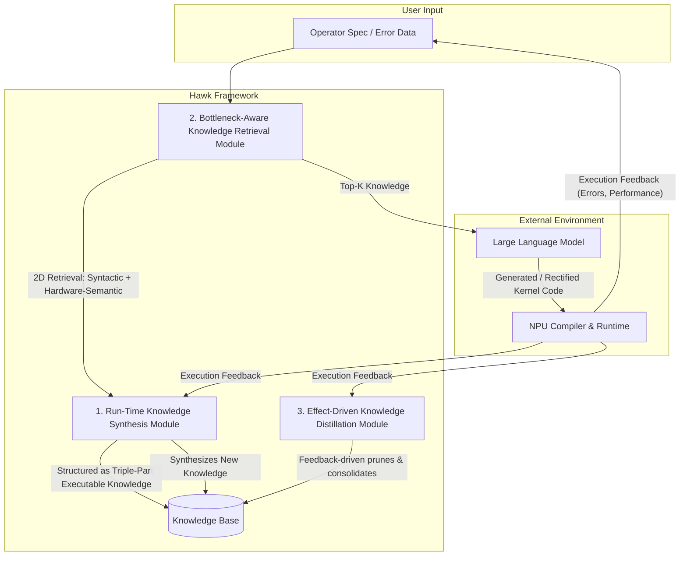

## 论文针对什么问题

这篇论文要解决的核心问题是：**如何利用大语言模型（LLM）为神经网络处理器（NPU）自动生成高性能的内核（kernel）代码**。

论文指出，LLM在NPU内核生成上表现出灾难性的失败，根本原因在于缺乏硬件特定的先验知识。具体表现为：

- **生成成功率极低**：最先进的LLM在NPU上的代码编译成功率（Comp@1）和功能正确率（Pass@1）仅为13.3%，相比之下，GPU上的同类任务高达100%和80%。
- **根本原因在于硬件知识缺失**：超过75%的失败来自底层的硬件特定误用，例如无效的API调用和内存布局不匹配。
- **存在严重的性能鸿沟**：即使功能正确，未经优化的NPU内核执行速度也比拥有相同理论算力的GPU慢近20倍。
- **现有方案存在瓶颈**：
    - **基于模型训练的方法**（如领域微调、强化学习引导）难以应对NPU API的频繁更新，导致数据过时，需要昂贵的重新训练。
    - **基于中间表示（IR）辅助的方法**（如领域特定语言、多面体编译器）则因NPU厂商闭源的黑盒特性而难以获得底层硬件细节，生成的内核性能不佳。

因此，论文致力于解决LLM在NPU内核生成中面临的三大挑战：
1.  **知识的异构结构化**：如何将自然语言规则、伪代码和可执行代码等多种模态的硬件知识，在有限的LLM上下文窗口中高效组织。
2.  **硬件感知的知识检索**：如何设计检索机制，能够超越表面的代码文本相似性，找到那些数学功能相同但因硬件约束而实现完全不同的内核知识。
3.  **上下文感知的知识维护**：如何根据实际执行的反馈，自动识别并剔除知识库中积累的错误和冗余信息。

## 提出了什么解决方案

论文提出了 **Hawk**，一个**无需训练（training-free）**的框架。Hawk通过三个核心模块动态地利用硬件感知知识来引导LLM生成和优化NPU内核，这三个模块分别对应于上述三大挑战：

1.  **运行时知识合成模块**：提出“三元可执行知识表示”来结构化存储硬件知识，耦合错误上下文与可执行语义，解决知识异构性挑战。
2.  **瓶颈感知的知识检索模块**：提出“二维检索”范式，将查询投影到正交的语法空间和硬件对齐的语义空间，解决硬件感知的检索挑战。
3.  **效果驱动的知识蒸馏模块**：利用LLM驱动的语义仲裁，根据执行反馈持续蒸馏知识，自动修剪错误、合并冗余，解决知识库维护挑战。

## 具体是怎么做的

Hawk的整体工作流程如下图所示（基于论文描述），通过一个迭代的反馈循环来优化内核代码。

**1. 运行时知识合成模块**
此模块的目的是将反馈的经验转化为结构化知识，具体采用“**三元可执行知识表示**”。每个知识条目被解构为三个层级的信息：
- **索引触发器**：如算子类型、数据类型，用于快速定位。
- **语义解析**：用自然语言解释硬件约束，如NPU统一缓冲区限制、分块（tiling）策略。
- **可执行代码模板**：提供精确的、可复用的代码实现。

这种结构化方式避免了简单拼接导致上下文爆炸或语法精度丧失的问题，将错误上下文与修复方案紧密耦合。

**2. 瓶颈感知的知识检索模块**
该模块解决从知识库中为当前任务检索最相关知识的问题。它提出了一个 **“二维检索”范式**：
- **语法轴**：利用传统的代码相似性，精确匹配API名称、调用序列等语法特征。
- **硬件语义轴**：通过将查询和知识库条目投影到一个硬件对齐的嵌入空间，来捕捉深层硬件约束（如内存布局、张量形状等）的相似性。
通过在这两个正交维度上进行联合检索，该模块能区分出数学功能相同但硬件瓶颈不同的算子，从而提供精准的知识。

**3. 效果驱动的知识蒸馏模块**
该模块负责维护知识库的健康度。当积累了大量执行反馈后，它会根据**执行效果（经验反馈）**对知识库进行批量处理。具体操作包括：
- **错误修剪**：如果某条知识在历史记录中导致编译或运行失败，会被自动识别并移除。
- **冗余合并**：利用LLM进行语义仲裁，将多条功能等价或重复的策略合并为一条最具代表性的知识，以释放宝贵的上下文窗口预算。

## 取得了什么效果

论文在真实世界的NPU负载上进行了广泛评估，主要效果如下：

- **准确率显著提升**：将NPU内核的生成准确率从基线方法的**49.4%提升到了80.0%**。
- **性能大幅领先**：与最先进的基线方法相比，生成的内核在真实硬件上最高取得了 **2.2倍** 的执行加速。
- **模块有效性验证**：通过消融研究证明，三个核心模块（运行时知识合成、瓶颈感知检索、效果驱动蒸馏）均对最终效果有正面贡献。原文摘录/摘要未提供更详细的消融实验具体数值和硬件平台细节。

## 旁观者视角的问题与不足

1.  **对LLM冷启动能力的依赖未明确评估**：框架的核心是“利用知识”，而这些知识最初需要从LLM错误中“合成”。如果初始LLM（即使带上了检索到的知识）对一个全新算子生成代码的成功率为0%（即无法产生可执行反馈），Hawk的“试错-反馈”闭环将无法启动。论文未讨论这种冷启动失败场景及应对方法。
2.  **“硬件对齐的语义空间”的实现细节不明**：二维检索中的“硬件语义轴”是核心创新点，但论文摘要和摘录并未说明该语义空间是如何构建的。是通过预训练的代码大模型还是基于特定硬件特征（如内存带宽、算子强度）手工设计的特征？这直接关系到方法的跨硬件泛化能力。
3.  **知识蒸馏的评估可能过于乐观**：效果驱动的蒸馏基于历史执行反馈，如果新任务与历史任务的硬件瓶颈不同，贸然修剪看似“错误”的旧知识，可能会丢失掉对处理特殊边缘情况有价值的经验。论文摘录未提及对蒸馏策略“误删”风险的评估。

## 值得继续追踪的点

1.  **跨不同厂商NPU的迁移能力**：论文实验仅在真实世界NPU负载上进行，未指明是一类还是多类NPU。Hawk对知识的结构化设计（特别是硬件语义轴）能否无缝迁移到其他厂商的NPU（如华为昇腾、寒武纪等）是衡量其价值的关键。
2.  **与编译器技术的深度结合**：Hawk目前是一个后处理式的反馈框架。未来若能将其反馈循环与NPU编译器的中间表示或优化Pass直接结合，如直接在IR层面进行知识指导的优化，有望实现更深层次的性能提升。
3.  **知识库的初始化与共享机制**：论文未提及知识库是“冷启动”还是可以用现有文档/代码库进行预热。一个社区共享、可进化的NPU内核知识库是一个非常有前景的方向，其构建和维护的生态机制值得关注。

## 元数据与链接

- **标题**：Hawk: Harnessing Hardware-Aware Knowledge for High-Performance NPU Kernel Generation
- **作者**：Junyi Wen, Ruiyan Zhuang, Yongjia Xu, Pengtu Li, Rui Zou, Hongyi Chen, Chingman Wan, Puxu Yang, Wuhui Chen, Yanlin Wang
- **来源**：arXiv (Cornell University)
- **DOI**：N/A
- **原文链接**：[https://openalex.org/W7167380394](https://openalex.org/W7167380394)
- **PDF链接**：[https://arxiv.org/pdf/2607.01590](https://arxiv.org/pdf/2607.01590)
